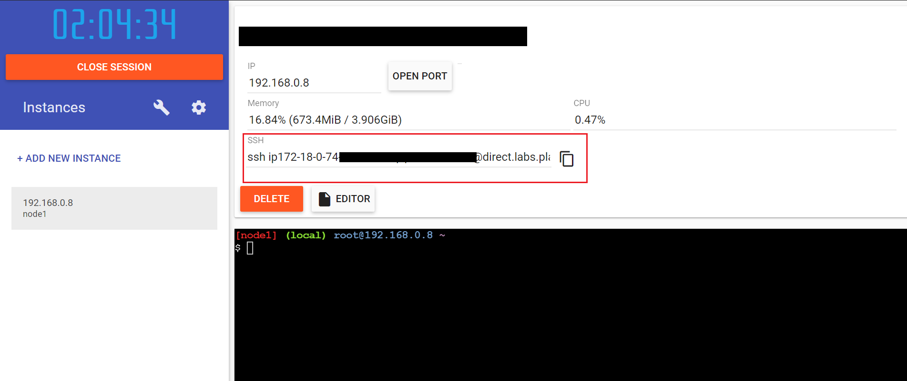
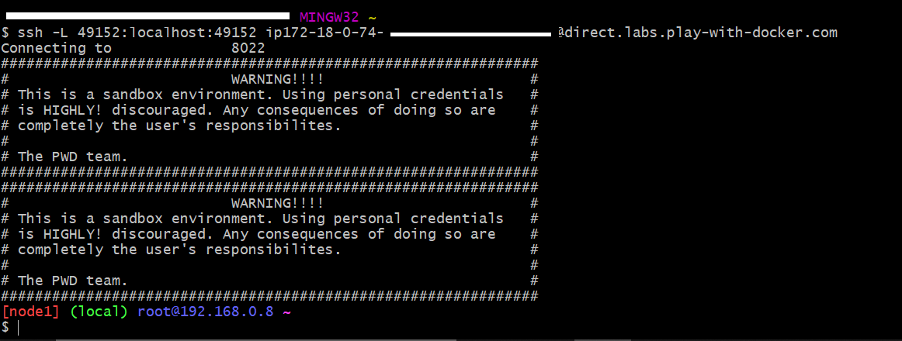
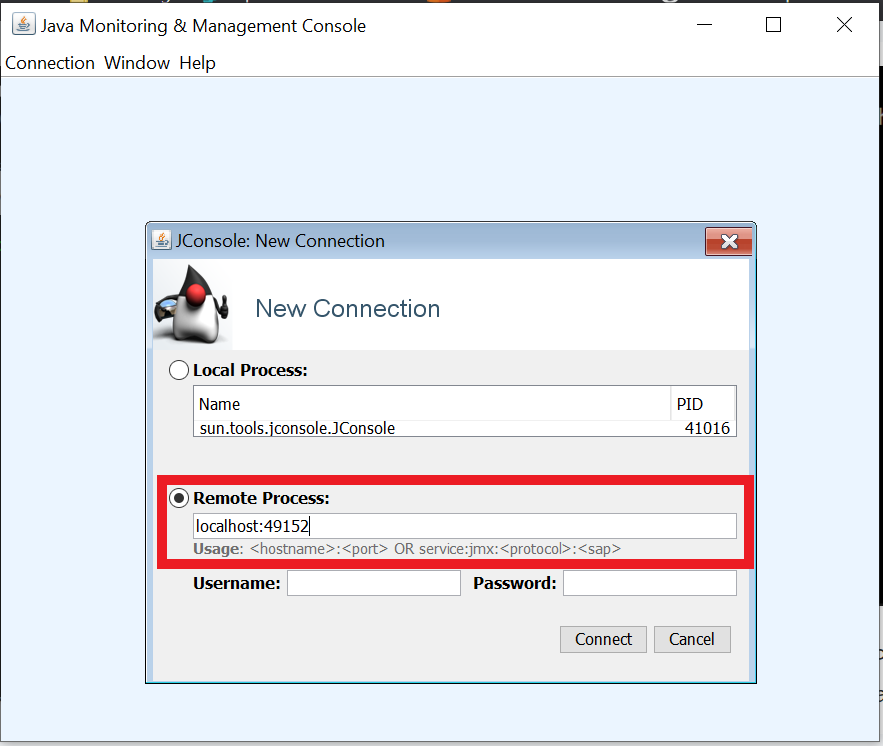
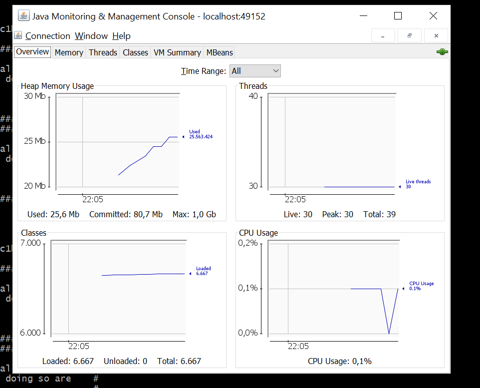

<p align="center">
    
</p>

# Openathon VIII QUARKUS - Algo de teoría e instalación

## Primer vistazo a Quarkus

En los últimos años hemos ido pasando de aplicaciones monolíticas, donde grandes servidores con grandes capacidades atendían muchas peticiones al mismo tiempo, a soluciones donde se crean y se destruyen rapidamente pequeños servidores basados en la nube o incluso donde se usan funciones serverless para procesar las peticiones, atender picos de demanda o incluso una determinada petición. En este nuevo enfoque, java partía en desventaja, ya que el consumo de recursos y el tiempo de arranque de las JVM era inadecuado para este tipo de soluciones, donde es necesario que cualquier servicio se arrancase y estuviese disponible en microsegundos y que su consumo de recursos fuese el menor posible para permitir convivir al mayor número de ellos. 

Esta es una de las causas por la que hemos visto en estos últimos años crecer otros lenguajes. Quarkus junto con GraalVM vienen a solucionar esta desventaja, permitiendo la creación de aplicaciones java con un tiempo de arranque mínimo y un tiempo de disponibilidad inmediato.

Quarkus es un nuevo framework opensource java, desarrollado por Red Hat y orientado a una ejecución optimizada en entornos de sin servidor, cloud y kubernetes. Está diseñado para funcionar con las librerías y frameworks más populares, tales como Eclipse Microprofile, Spring, Apache Kafka, RESTEasy (JAX-RS), Hibernate ORM (JPA), Spring Infinispan, Camel y muchos otros.

Una característica fundamental de Quarkus es la posibilidad de integrarse con GraalVM (una máquina virtual poliglota que permite la ejecución de diversos lenguajes de programación como Java, Javascript, Python…), para permitir la nativa compilación de las aplicaciones. La compilación nativa nos permite en el momento de la ejecución, eliminar la máquina virtual y llegar directamente a la API del sistema operativo, ganando con ello un incremento muy importante de la eficiencia de las aplicaciones, en términos de consumo de recursos y rendimiento. Esta capacidad de integración de Quarkus y GraaVM, es una ventaja crítica frente a los frameworks previamente existentes (¿Oyes eso Spring Boot?).

Quarkus está definido como ***SUPERSONIC SUBATOMIC JAVA***, ¿Por qué?
- **SUPERSONIC**
  - Está diseñado para ser rápida y fácilmente asimilado para los programadores con experiencia previa con java y su integración con los frameworks más populares, permiten que aprovechemos nuestros conocimientos previos.
  - Está diseñado para facilitar el desarrollo de aplicaciones, disponiendo automáticamente de un entorno de prueba que nos permite la modificación en caliente de nuestro código.
- **SUBATOMIC**
  - Pequeño en todos los aspectos, consumo de recursos, tamaño de las imágenes binarias…

Podéis ampliar información en su [página web](https://quarkus.io/).

## ¿Qué vamos a hacer?

En este Openathon vamos a comprobar si realmente Quarkus supone una diferencia frente a otros framework y en particular al que actualmente es el rey: Spring Boot. Vamos a crear dos pequeñas (muy pequeñas no os preocupéis :sweat_smile:) aplicaciones con cada uno de los frameworks y vamos a comparar su desempeño directamente en nuestra JVM y después en contenedores Docker utilizando imágenes no nativas y nativas.


## ¿Qué necesitamos?

Para realizar las actividades, necesitamos comprobar que la máquina donde vamos a hacerlo dispone de:

- [JDK 8 or 11 instalado](https://www.oracle.com/es/java/technologies/javase-jdk11-downloads.html).
- La variable [JAVA_HOME](https://docs.oracle.com/cd/E19182-01/821-0917/inst_jdk_javahome_t/index.html) correctamente configurada.
- [Apache Maven](https://maven.apache.org/download.cgi) 3.6.2+
- [Opcional] Un IDE que nos facilite el trabajo. En nuestro caso hemos utilizado [Visual Studio Code](https://code.visualstudio.com/), pero cualquier otro sería valido o incluso no usar ninguno y realizar todas las actividades con el Notepad, textEdit, Vim…
- [Docker](https://www.docker.com/) u otro gestor de contenedores.

***Nota:** Si nos decantamos por utilizar Docker como gestor de contenedores, hay que comprobar que el Pulse Secure instalado en el pc sea una versión igual o superior a 9.1, ya que existe una incompatibilidad con versiones inferiores entre Docker y Pulse Secure que provoca la desactivación de Wifi en el pc. ([Reinstalar_PulseSecure.pdf](../resources/Reinstalar_PulseSecure.pdf), manual reinstalación Pulse Secure.)*

## Alternativas para la ejecución del laboratorio en un pc windows

Previendo que los participantes podemos tener problemas para cumplir los requisitos especificados, hemos preparado cuatro posibles formas de realizar los laboratorios. Cada uno debe decidir cual es la que le resulta más adecuada (más abajo se explica la alternativa de *Linux virtualizado* y de *Play With Docker*):

|   | Alternativa | Pros | Contras |
| --- | --- | --- | --- |
| 1 | Windows + Docker Desktop | Si es tu herramienta de trabajo habitual es cómodo. | Limitaciones de espacio, puede haber incompatibilidades con software instalado (ver nota del punto anterior) |
| 2 | Play with Docker | No requiere de instalacion en local ni espacio adicional, es un linux en la nube| Montar el entorno cada vez que se accede, puede haber algun cuello de botella si hay mucha gente conectada simultaneamente. |
| 3 | Linux Virtualizado (VirtualBox, VMWAre, etc) | Aisla la instalación de herramientas y actua como una sandbox. Es una manera de entrar al mundo Linux / linea de comandos si no lo has hecho nunca. | Limitaciones de espacio, puede requerir 15-20GB libres.  |
| 4 | Mac o Linux Workstation| Si es tu herramienta de trabajo habitual es cómodo. | Puede haber incompatibilidades con software instalado. |

### Linux virtualizado 🐧

Para la alternativa de Linux virtualizado hemos realizado un par de documentos que explican la instalación paso a paso de un Xubuntu 20.04 sobre Oracle VM VirtualBox y tambien la preparacion del entorno de desarrollo necesario para el Openathon.

 - [XubuntuVirtualBoxInstallation.pdf](../resources/XubuntuVirtualBoxInstallation.pdf),  instalación de Xubuntu con Virtual Box paso a paso.
 
 - [XubuntuVirtualBoxDevEnv.pdf](../resources/XubuntuVirtualBoxDevEnv.pdf), instalación de herramientas de desarrollo en Xubuntu, JVM, docker, maven, git y vscode para el openathon 

### Alternativa Zero Config - Play With Docker (PWD) 🐳

[Play with Docker](https://labs.play-with-docker.com/) es una plataforma web que nos permite trabajar con maquina linux con Docker instalado (mirar el siguiente [enlace](https://github.com/Accenture/openathon-2019-docker/tree/master/lab-00) para más información e uso básico). Los requisitos son los siguientes:

1. Tener un usuario en DockerHub.
2. Ejecutar un script o los comandos que indicamos a continuación en la instancia de PWD.
3. En nuestra máquina local:
    1. Un cliente ssh (Git bash por ejemplo).
    2. Java instalado y configurado.

> 🐳 Para cpegar en la consola web de PWD  hacer Control + Shift + V.

> 🐳 Con Alt + Enter la consola se pone en pantalla completa, para que os sea más fácil trabajar.

Para configurar la instancia de PWD os vamos a dejar dos opciones, una que consiste en la ejecución de un script que hemos creado y otra ir paso a paso, instalando cada una de las herramientas:

1. [Ejecución de script](#ejecución-de-script)
2. [Instalación paso a paso](#instalación-paso-a-paso)

#### Ejecución de script

En script se encuentra en el siguiente [enlace](../resources/init-pwd.sh). Tenemos que descargar el script en la maquina de PWD y ejecutarlo con *source* (para mantener las variables de entorno):

```sh
wget https://raw.githubusercontent.com/ddtorremocha/openathon_viii_quarkus/main/resources/init-pwd.sh -O init-pwd.sh
source init-pwd.sh
```

El script lanza un proceso java de ejemplo para validar la instalación y la monitorización remota (haciendo uso de dos variables de entorno **RMI_PORT** y **JMX_OPTIONS** las cuales podeis usar para lanzar los jar en los siguientes laboratorios). Por lo que en la página de PWD nos copiamos el HOSTNAME:

<p align="center">
    
</p>

Y ejecutamos en una terminal local el comando ssh para redirigir el tráfico:

```sh
ssh -L 49152:localhost:49152 <PWD_HOST>
```

Si todo va bien obtendremos un resultado similar al siguiente:

<p align="center">
    
</p>


Si os sale el siguiente mensaje *Permission denied (publickey)*, teneis que generar un par clave pública-privada. Para ello debemos ejecutar **ssh-keygen**, dejando el nombre del fichero por defecto (**id_rsa**) e indicando opcionalmente una contraseña: 
```sh
$ ssh-keygen
Generating public/private rsa key pair.
Enter file in which to save the key (/Users/josdev27/.ssh/id_rsa):
Enter passphrase (empty for no passphrase):
Enter same passphrase again:
Your identification has been saved in /Users/josdev27/.ssh/id_rsa.
Your public key has been saved in /Users/josdev27/.ssh/id_rsa.pub.
The key fingerprint is:
...
```

> 🐳 Si indicais otro nombre de fichero que no sea el de por defecto, cuando hagais *ssh* teneis que indicar la opción *-i <nombre-fichero>*

Ahora en otra terminal local ejecutaremos *jconsole* para comprobar la monitorización remota del proceso java que hemos lanzado:

```sh
jconsole
```

En la ventana abierta, dentro de *remote process*, indicamos localhost:49152, que es el puerto RMI indicado:

<p align="center">
    
</p>

Si todo está correcto veremos la gráficas de monitorización del proceso java remoto:


<p align="center">
    
</p>

Ahora matamos el proceso java ejecutando el siguiente comando en la terminar conectada a PWD:

```sh
pkill java
```

#### Instalación paso a paso

Ahora vamos a realizar los pasos necesarios para dejar la máquina configurada para los laboratorios:

##### Instalar OpenJDK11 y Maven3

El primer paso es instalar OpenJDK11 y Maven3, para depués crear la variable de entorno *JAVA_HOME*:

```sh
apk add openjdk11 maven
export JAVA_HOME=/usr/lib/jvm/default-jvm
```

[^1]: usamos apk porque la máquina es un Alphine Linux

Ejecutamos los siguientes comandos para validar la instalación:

```sh
java --version
mvn --version
```

##### Instalar Spring-Boot-CLI

El siguiente paso es instalar el cli de spring boot para inicializar aplicación de spring boot:

```sh
# Descomprimimos el tar. Crea la carpeta spring-2.4.3
tar -zxf spring-boot-cli-2.4.3-bin.tar.gz
rm -rf spring-boot-cli-2.4.3-bin.tar.gz
mv spring-2.4.3 /opt

export PATH=/opt/spring-2.4.3/bin:$PATH

# Ejemplo de uso:
# Creamos una aplicación Spring Boot con la dependencia web
spring init --dependencies=web my-project
```

##### Modificar sshd

Para poder monitorizar los procesos Java que lancemos en la máquina de Play With Docker, nos vamos a conectar por ssh desde nuestra máquina local a la remota y hacer una redirección de puertos (opción  *AllowTcpForwarding=yes*). Para ello, vamos a matar el proceso *sshd*, y ejecutarlo indicandole las opciones necesarias:

```sh
kill -9 $(pidof sshd)
/usr/sbin/sshd -o AllowTcpForwarding=yes -o PermitRootLogin=yes
```

Ahora desde nuestra máquina local, podemos ejecutar el siguiente comando, para redirigir todo el tráfico que en nuestra máquina vaya por un determinado puerto: 

```sh
ssh -L <RMI_PORT>:localhost:<RMI_PORT> <HOST_MAQUINA_PWD>
```

[^1]: El puerto será el que indiquemos a JMX cuando lancemos los procesos.

##### Testing

A modo de ejemplo y ver que todo funciona correctamente compilaremos el proyecto generado con *spring-cli* y monitorizaremos el proceso java desde nuestra máquina local, haciendo uso de dos variables de entorno **RMI_PORT** y **JMX_OPTIONS** las cuales podeis usar para lanzar los jar en los siguientes laboratorios:

```sh
# Generamos el jar
mvn -f my-project/pom.xml package

# Lanzamos la aplicación indicando el puerto RMI 49152
export RMI_PORT=49152
export JMX_OPTIONS="-Dcom.sun.management.jmxremote.ssl=false -Dcom.sun.management.jmxremote.authenticate=false -Dcom.sun.management.jmxremote.port=$RMI_PORT -Dcom.sun.management.jmxremote.rmi.port=$RMI_PORT -Djava.rmi.server.hostname=localhost -Dcom.sun.management.jmxremote.local.only=false"

java $JMX_OPTIONS -jar my-project/target/my-project-0.0.1-SNAPSHOT.jar 1> /dev/null &
```

En la página de PWD nos copiamos el HOSTNAME:


<p align="center">
    
</p>

Y ejecutamos en una terminal local el comando ssh para redirigir el tráfico:

```sh
ssh -L 49152:localhost:49152 <PWD_HOST>
```

Si todo va bien obtendremos un resultado similar al siguiente:

<p align="center">
    
</p>

```sh
ssh -L 49152:localhost:49152 <HOST_PWD>
```

Si os sale el siguiente mensaje *Permission denied (publickey)*, teneis que generar un par clave pública-privada. Para ello debemos ejecutar **ssh-keygen**, dejando el nombre del fichero por defecto (**id_rsa**) e indicando opcionalmente una contraseña: 
```sh
$ ssh-keygen
Generating public/private rsa key pair.
Enter file in which to save the key (/Users/josdev27/.ssh/id_rsa):
Enter passphrase (empty for no passphrase):
Enter same passphrase again:
Your identification has been saved in /Users/josdev27/.ssh/id_rsa.
Your public key has been saved in /Users/josdev27/.ssh/id_rsa.pub.
...
```

> 🐳 Si indicais otro nombre de fichero que no sea el de por defecto, cuando hagais *ssh* teneis que indicar la opción *-i <nombre-fichero>*

Ahora en otra terminal local ejecutaremos *jconsole* para comprobar la monitorización remota del proceso java que hemos lanzado:

```sh
jconsole
```

En la ventana abierta, dentro de *remote process*, indicamos localhost:49152, que es el puerto RMI indicado:

<p align="center">
    
</p>

Si todo está correcto veremos la gráficas de monitorización del proceso java remoto:


<p align="center">
    
</p>

Ahora matamos el proceso java ejecutando el siguiente comando:

```sh
pkill java
```


[< Introduccion](../README.md) | [Lab 01>](../lab-01) 

<p align="center">
    
</p>
