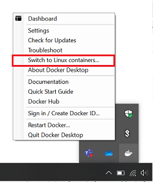
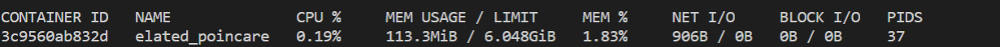
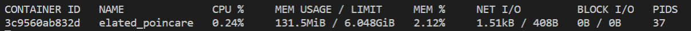

<p align="center">
    
</p>

# Openathon VIII QUARKUS - Dockerizando la aplicación

## Creando un Contenedor para nuestro proyecto Quarkus

Vamos ahora a crear un contenedor y ejecutar la aplicación dentro de un contenedor docker. Para los que lo tenéis olvidado, os recuerdo el magnifico trabajo que hicieron nuestros compañeros hace unos meses en el [Openathon V](https://github.com/Accenture/openathon-2019-docker) dedicado precisamente a Docker.


En un primer paso vamos a crear el contenedor para utilizar la JVM, para poder comprobar luego si la alternativa “nativa” supone realmente ventajas. Para ello vamos a utilizar el dockerfile que ha creado el plugin de Quarkus en nuestro proyecto.

- Creamos primero la imagen de la aplicación.

```console
docker build -f src/main/docker/Dockerfile.jvm -t openathon/quarkus_no_nativo .
```

Como vemos utilizamos Dockerfile.jvm, no tenemos que modificar nada, todo está ya dispuesto para crear el contenedor.

El proceso puede tardar unos minutos… Calma y dock… Tranquilidad!! :sleeping:.

-Si tras haber lanzado la creación de la imagen en Windows, no se consigue hacer y salta este error:
```console
Step 1/11 : FROM registry.access.redhat.com/ubi8/ubi-minimal:8.3
8.3: Pulling from ubi8/ubi-minimal
no matching manifest for windows/amd64 10.0.18363 in the manifest list entries
```
Abre el tray del Dockers y comprueba que estás en el container de Linux.

|  |

- Una vez que termine el proceso, podemos comprobar que la imagen se ha creado bien y su tamaño ejecutando:
```console
docker images
```
Veremos en el resultado que nuestra imagen no nativa, ocupa 382 MB.
```console
REPOSITORY                                   TAG             IMAGE ID       CREATED             SIZE
openathon/quarkus_no_nativo                  latest          4828c21c1b84   31 minutes ago      382MB
```

- A continuación podemos crear el contenedor a partir de la imagen:
```console
docker run -p 8080:8080 openathon/quarkus_no_nativo
```

Recordando el Openathon de Docker:
| Instrucción | Significado |
| ------------- | ------------- |
| docker  | Invocación a Docker |
| run  | Indica a Docker que queremos levantar un contenedor |
| -p 8080:8080 | Indica los puertos que están expuestos en nuestro contenedor y como se redireccionan en nuestro sistema host |
| openathon/quarkus_no_nativo | Nombre de la imagen que queremos levantar en el contenedor |

Podemos comprobar que el arranque en los log:
```console
021-02-20 21:09:41,655 INFO  [io.quarkus] (main) openathon-quarkus-avd 1.0.0-SNAPSHOT on JVM (powered by Quarkus 1.11.3.Final) started in 1.810s. Listening on: http://0.0.0.0:8080
```
En nuestro caso, el tiempo de arranque fue de 1,8 segundos, ¡No está mal!

- Una vez arrancado podemos monitorizar el contenedor.
```console
docker stats
```

Que en nuestro caso resulta en un consumo de:
|  |

- Podemos comprobar que nuestra imagen está ejecutando correctamente si invocando por consola devuelve el mensaje esperado. Si aún tenemos stats en ejecución, comprobaremos que el uso de memoria se ha incrementado tras la primera invocación. 

```console
curl -w "\n" http://localhost:8080/helloOpenathon
```

|  |


## Actividad extra.

¿Te animas a hacer lo mismo con el dockerfile.fast-jar?, ¿habrá alguna diferencia?.

> Para poder generar el jar fast, teneis que ejecutar *mvn package -Dquarkus.package.type=fast-jar*

[<Lab 01](../lab-01) | [Lab 03>](../lab-03) 

<p align="center">
    
</p>
